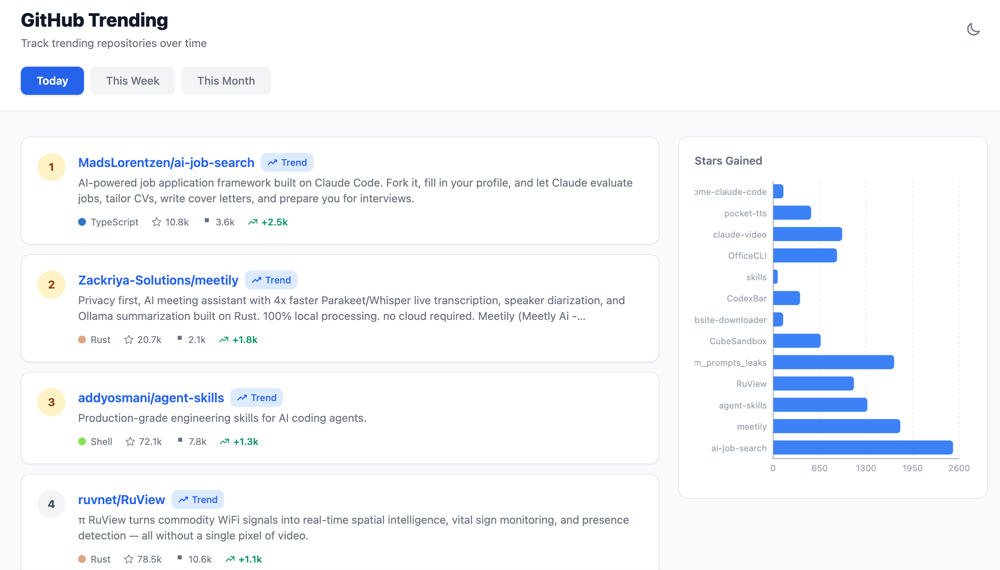
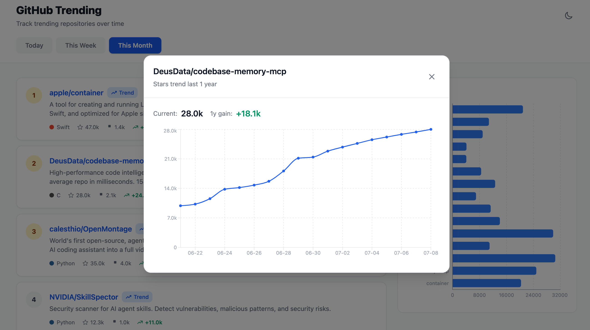
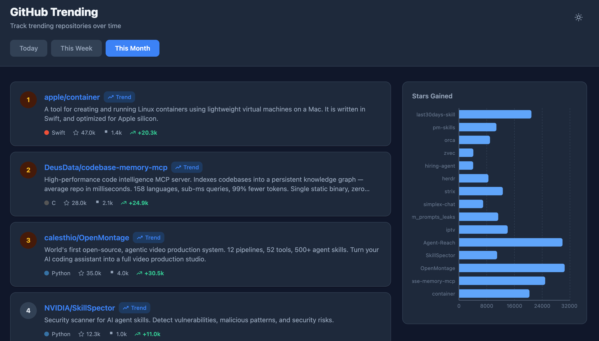

# GitHub Trending 趋势统计

[English](README.en.md)

基于 GitHub Trending 榜单，抓取并整理 daily / weekly / monthly 三个周期的上榜项目，统计展示各项目的历史 Star 增长趋势，方便直观地追踪热门项目的走势。

## 功能特性

- 抓取 GitHub Trending daily / weekly / monthly 三个周期的榜单
- 榜单内按语言筛选、Star 数柱状图展示
- 点击项目查看近 90/180/365 天（按周期区分）的 Star 增长趋势图
- Dark Mode
- 每日 08:00 定时自动抓取，无需手动刷新

## 截图

### 榜单页面



### Star 趋势图



### Dark Mode



## 技术栈

**后端**
- FastAPI — Python Web 框架
- SQLAlchemy 2.0 — ORM，SQLite 数据库
- BeautifulSoup4 — HTML 解析，抓取 GitHub Trending
- APScheduler — 定时任务调度

**前端**
- React 19 — UI 框架
- Vite 8 — 构建工具
- Tailwind CSS v4 — 样式框架
- Recharts — 图表库

## 项目结构

```
github-trending/
├── backend/
│   ├── scraper/
│   │   ├── github_trending.py   # 抓取逻辑
│   │   └── scheduler.py         # 定时任务(APScheduler)
│   ├── api/
│   │   ├── main.py              # FastAPI 入口
│   │   └── routes.py            # /trending/{period} 接口
│   ├── db/
│   │   ├── models.py            # SQLAlchemy 模型
│   │   └── database.py          # 连接配置
│   └── requirements.txt
├── frontend/
│   ├── src/
│   │   ├── components/
│   │   │   ├── TrendingTable.jsx
│   │   │   ├── PeriodTabs.jsx
│   │   │   └── StarChart.jsx
│   │   ├── App.jsx
│   │   └── main.jsx
│   ├── package.json
│   └── vite.config.js
└── README.md
```

## 快速开始

### 后端

```bash
cd backend
python -m venv venv
source venv/bin/activate
pip install -r requirements.txt
uvicorn api.main:app --reload --port 8000
```

### 前端

```bash
cd frontend
npm install
cp .env.example .env
npm run dev
```

启动后访问终端输出的地址（默认 `http://localhost:5173`）。

也可以直接运行根目录下的 `start.sh`（后端）和 `start-frontend.sh`（前端），二者是等效的便捷脚本，额外绑定了局域网可访问的地址（`--host`），适合需要在同一局域网内其他设备上访问的场景。

## API 接口

| 方法 | 路径 | 说明 |
|------|------|------|
| GET | `/api/trending/{period}` | 获取 trending 列表 (daily/weekly/monthly) |
| POST | `/api/trending/{period}/scrape` | 手动触发抓取 |
| GET | `/api/languages` | 获取所有语言列表 |

## 定时任务

- 每日 08:00 抓取 daily trending
- 每周一 08:00 抓取 weekly trending
- 每月 1 日 08:00 抓取 monthly trending

（仅在后端服务持续运行时生效）

## License

[MIT](LICENSE)
